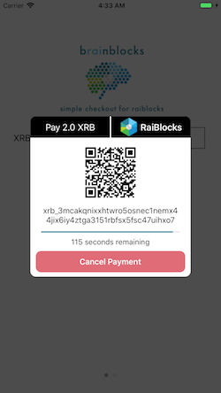

# brainblocks-ios-sdk
iOS SDK for integrating [BrainBlocks](http://BrainBlocks.io) into a mobile app




## Installation

### CocoaPods

[CocoaPods](http://cocoapods.org) is a dependency manager for Cocoa projects. You can install it with the following command:

```bash
$ gem install cocoapods
```
> CocoaPods 1.4+ is required to build BrainBlocksKit.

To integrate BrainBlocks into your Xcode project using CocoaPods, specify it in your `Podfile`:

```ruby
source 'https://github.com/CocoaPods/Specs.git'
platform :ios, '11.0'
use_frameworks!

target '<Your Target Name>' do
  pod 'BrainBlocksKit'
end
```

Then, run the following command:

```bash
$ pod install
```

## Usage

### Recommend Method
In the ViewController that you would like to use BrainBlocks, import BrainBlockKit and implement code like the following.

```swift
import UIKit
import BrainBlocksKit

class ViewController: UIViewController {

    override func viewDidLoad() {
        super.viewDidLoad()
    }
    
    // Example Function
    func showPayment() {
        // payment rai amount. rai = 1xrb/1000000
        var amount: Int = 1 
        let paymentAccount: String = "<Your XRB Payment Address Here>"
        
        // Launch BrainBlocks Popup Payment UI
        BrainBlocksPayment().launchBrainBlocksPaymentView(viewController: self, paymentAmount: amount, paymentDestination: paymentAccount)
    }
 }
 ```
 
### Alternative Method

The Following functions can also be used as an alternative to the simple popup ui. Do Not use these with popup ui

```swift
// start brainblocks payment session
// saves token to BrainBlocksPayment.token
// saves payment account address to BrainBlocksPayment.account
// saves payment amount to BrainBlocksPayment.paymentAmount
// launch's brainBlocksTransferPayment() automatically 
func brainBlocksStartSession(paymentAmount amount: Int, paymentDestination destination: String)
```

```swift
// start brainblocks transfer session for payment
// posts BrainBlocksPaymentFailed notification if failed else launches brainBlocksVerifyPayment()
func brainBlocksTransferPayment(token: String) {}
```

```swift
// verfiy brainblocks payment
// checks if token and amounts are corrent
// if correct, post BrainBlocksPaymentSuccess notification else
// post BrainBlocksInsufficientPayment notification
func brainBlocksVerifyPayment(token: String) {}
```

```swift
// cancels BrainBlocks Payment Session
func cancelBrainBlocksPaymentSession() {}
```
 
## BrainBlocks SDK Events

The BrainBlocks SDK uses local notifications to send events. Each of the following event observer's is optional but are needed to know when a specific event happens.

#### BrainBlocksSessionStart notification
```swift
// Example BrainBlocksSessionStart notification and function
NotificationCenter.default.addObserver(self, selector: #selector(sessionStart), name: NSNotification.Name(rawValue: "BrainBlocksSessionStart"), object: nil) 

@objc func sessionStart() {
    print("BrainBlocks Payment Session Started")
}
```

#### BrainBlocksSessionStartFailed notification
```swift
// BrainBlocksSessionStartFailed notification and function
NotificationCenter.default.addObserver(self, selector: #selector(sessionStartFailed), name: NSNotification.Name(rawValue: "BrainBlocksSessionStartFailed"), object: nil) 

@objc func sessionStartFailed() {
    print("BrainBlocks Payment Session Failed")
}
```

#### BrainBlocksPaymentSuccess notification
```swift
// BrainBlocksPaymentSuccess notification and function
NotificationCenter.default.addObserver(self, selector: #selector(sessionSuccess), name: NSNotification.Name(rawValue: "BrainBlocksPaymentSuccess"), object: nil) 

@objc func sessionSuccess() {
    print("session success")
}
```

#### BrainBlocksPaymentFailed notification
```swift
// BrainBlocksPaymentFailed notification and function
NotificationCenter.default.addObserver(self, selector: #selector(sessionFailed), name: NSNotification.Name(rawValue: "BrainBlocksPaymentFailed"), object: nil) 

@objc func sessionFailed() {
    print("session failed")
}
```

#### BrainBlocksSessionCancelled notification
```swift
// BrainBlocksSessionCancelled notification and function
NotificationCenter.default.addObserver(self, selector: #selector(sessionCancelled), name: NSNotification.Name(rawValue: "BrainBlocksSessionCancelled"), object: nil) 

@objc func sessionCancelled() {
    print("session cancelled")
}
```

#### BrainBlocksSessionTimeOut notification
```swift
// BrainBlocksSessionTimeOut notification and function
NotificationCenter.default.addObserver(self, selector: #selector(sessionTimeOut), name: NSNotification.Name(rawValue: "BrainBlocksSessionTimeOut"), object: nil) 

@objc func sessionTimeOut() {
    print("session time out")
}
```

#### BrainBlocksInsufficientPayment notification
```swift
// BrainBlocksInsufficientPayment notification and function
NotificationCenter.default.addObserver(self, selector: #selector(insufficientPayment), name: NSNotification.Name(rawValue: "BrainBlocksInsufficientPayment"), object: nil)

@objc func insufficientPayment() {
    print("session insufficient payment")
}
```

## Donate 

Donate to schenkty (contributor): xrb_1jnatu97dka1h49zudxtpxxrho3j591jwu5bzsn7h1kzn3gwit4kejak756y

Donate to BrainBlocks: xrb_164xaa1ojy6qmq9e8t94mz8izr4mkf1sojb6xrmstru5jsif48g5kegcqg7y
