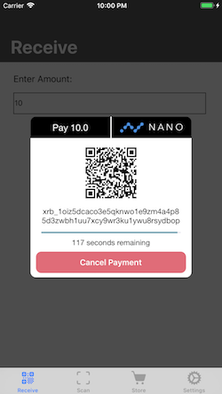

# BrainBlocks iOS SDK
iOS SDK for integrating [BrainBlocks](http://BrainBlocks.io) into a mobile app

[SDK Video Demo](https://www.youtube.com/watch?v=LlhImlhOeyQ)




## Installation

### CocoaPods

[CocoaPods](http://cocoapods.org) is a dependency manager for Cocoa projects. You can install it with the following command:

```bash
$ gem install cocoapods
```
> CocoaPods 1.4+ is required to build BrainBlocksKit.

To integrate BrainBlocks into your Xcode project using CocoaPods, specify it in your `Podfile`:

```ruby
source 'https://github.com/CocoaPods/Specs.git'
platform :ios, '12.0'
use_frameworks!

target '<Your Target Name>' do
  pod 'BrainBlocksKit'
end
```

Then, run the following command:

```bash
$ pod install
```

## Usage

In the ViewController that you would like to use BrainBlocks, import BrainBlockKit and implement code like the following.

```swift
import UIKit
import BrainBlocksKit

class ViewController: UIViewController, BrainBlocksDelegate {

    override func viewDidLoad() {
        super.viewDidLoad()
        showPayment()
    }
    
    // Example Function
    func showPayment() {
    
        // payment nano amount. nano = 1 NANO/1000000
        var amount: Double = 1
        
        // payment view
        let style: UIBlurEffectStyle = .light
        
        // Payment Destination
        let paymentAccount: String = "<Your Nano Payment Address Here>"
        
        let paymentController = BBPaymentController.create()
        paymentController.delegate = self
        paymentController.blurStyle = style
        paymentController.destinationAddress = paymentAccount
        paymentController.paymentAmount = amount
        paymentController.currency = .nano
        paymentController.modalPresentationStyle = .fullScreen
        
        // Launch BrainBlocks Popup Payment UI
        self.present(paymentController, animated: true, completion: nil)
    }
    
    func paymentSessionUpdate(status: BBResponses, data: BBSessionObject?) {
    
    }
    
    func paymentComplete(object: BBVerificationObject) {
        
    }
    
 }
 ```

## BrainBlocksKit Delegate
```swift
func paymentSessionUpdate(status: BBResponses, data: BBSessionObject?)
func paymentComplete(object: BBVerificationObject)
```
## BrainBlocksKit VerificationObject
```swift
struct BBVerificationObject {
    let token: String
    let destination: String
    let currency: String
    let amount: Int
    let amountRai: Int
    let receivedRai: Int
    let fulfilled: Bool
    let sendBlock: String
    let sender: String
}
```
